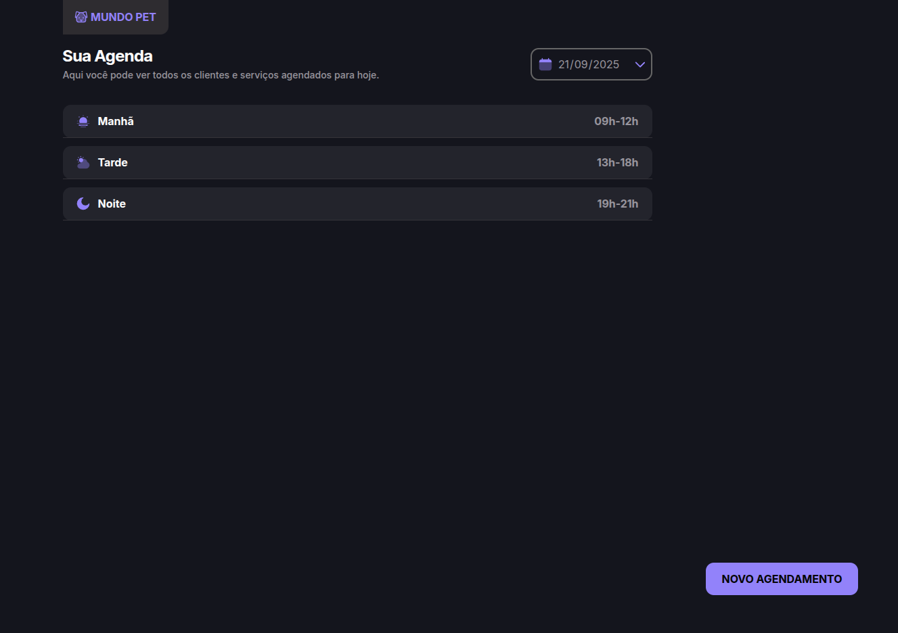
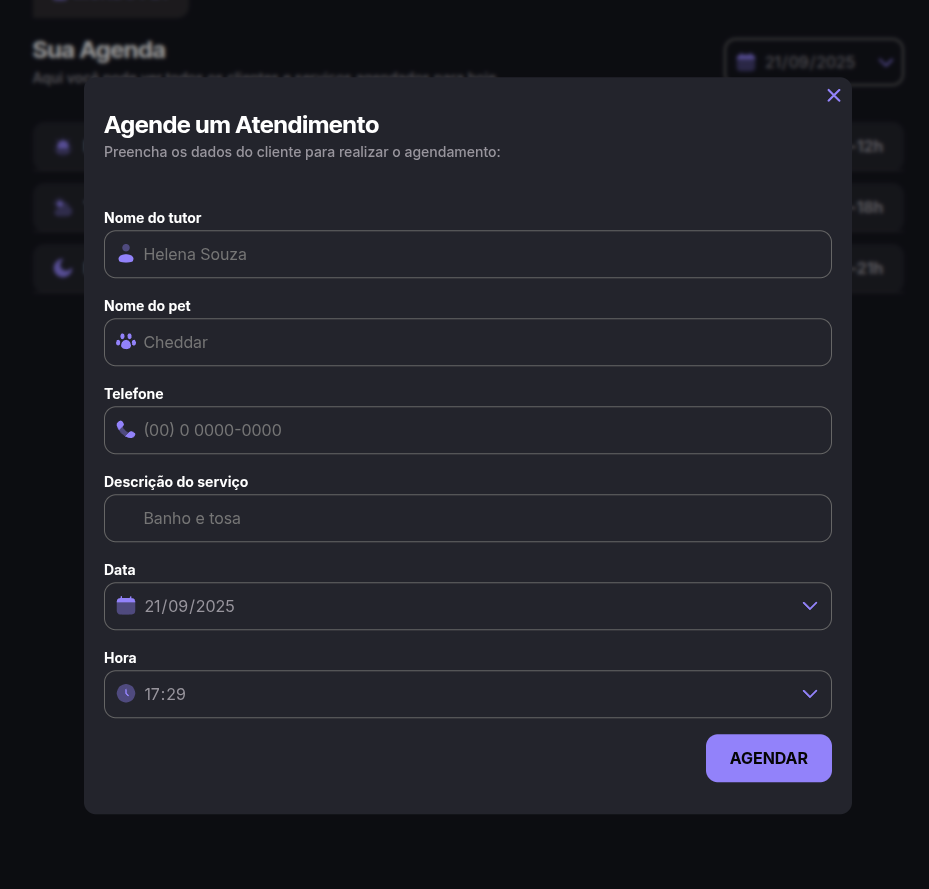

# 🐾 Agendamento Petshop

Aplicação Web para agendamento de serviços de petshop, desenvolvida durante a **Parte 2 do curso Full-Stack da Rocketseat**.  
O projeto reforça o uso de **JavaScript modularizado**, **Webpack** e **JSON Server** para simular uma API.

---

## 🖼️ Preview

<p align="center">
  <br>
  
</p>

---

## 🚀 Funcionalidades
- Agendamento de serviços para pets (nome, data, serviço).  
- Visualização e cancelamento de agendamentos.  
- Validações no formulário.  
- Integração com **JSON Server** para persistência fake dos dados.  
- Estilização moderna e responsiva.  

---

## 🛠️ Tecnologias
- **HTML5**  
- **CSS3**  
- **JavaScript (ES Modules)**  
- **Webpack**  
- **Babel**  
- **Day.js**  
- **JSON Server**

---

## ▶️ Como Executar
1. Clone este repositório.
2. Acesse a pasta do projeto:
   ```bash
   cd agendamento-petshop
3. Instale as dependências:
   ```bash
   npm install
   ```
4. Inicie o servidor fake (JSON Server):
    ```bash
npm run server
    ```


O servidor rodará em http://localhost:3333
.

Em outro terminal, inicie o ambiente de desenvolvimento:

```
npm run dev
```


Acesse http://localhost:3000
 no navegador para visualizar a aplicação.