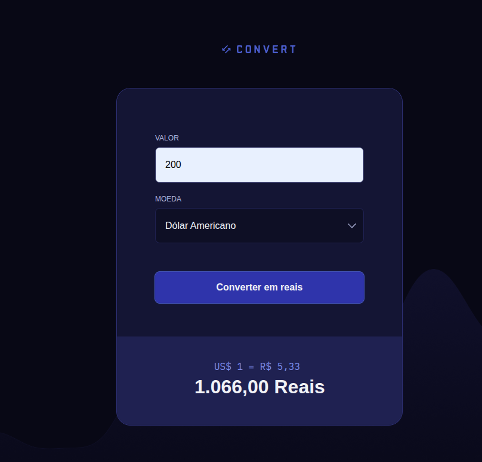
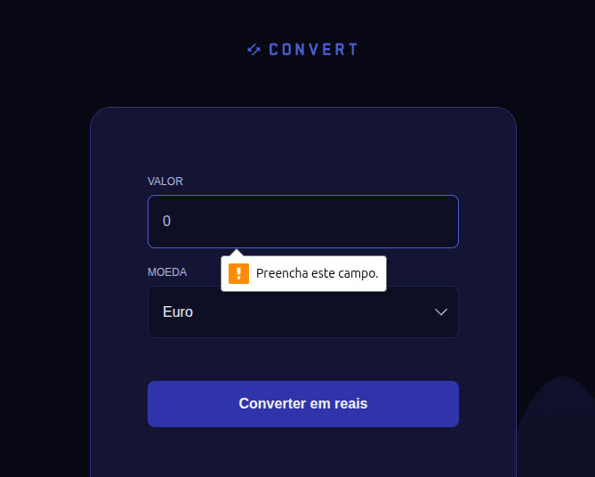

# 💱 Convert

Projeto de conversão de moedas, desenvolvido durante a **Parte 2 do curso Full-Stack da Rocketseat**.  
O objetivo é praticar manipulação do **DOM**, eventos de formulário e cálculos dinâmicos com JavaScript.

---

## 🚀 Funcionalidades
- Conversão de valores de **USD, EUR e GBP para BRL**.  
- Validação do input para aceitar apenas números.  
- Exibição dinâmica do valor convertido.  
- Mensagem de erro caso o valor não seja válido.  
- Atualização do resultado em tempo real com formatação adequada.

---

## 🖼️ Preview

<p align="center">
  <br>
  <br>
  
</p>

---

## 🛠️ Tecnologias
- **HTML5**
- **CSS3**
- **JavaScript (DOM, Eventos, Funções)**

---

## ▶️ Como Executar
1. Clone este repositório.
2. Acesse a pasta do projeto:
   ```bash
   cd convert
    ```