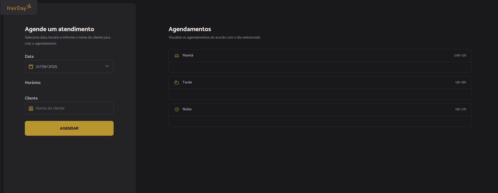

# 💇‍♂️ Hairday

Aplicação Web de agendamento para cortes de cabelo
O objetivo é praticar o uso de **módulos JavaScript**, integração com **JSON Server** e organização do projeto com **Webpack**.

---

## 🖼️ Preview

<p align="center">
  <br>
</p>

---

## 🚀 Funcionalidades
- Formulário de agendamento com data e horário.  
- Listagem de agendamentos salvos.  
- Cancelamento de agendamentos existentes.  
- Integração com **JSON Server** simulando uma API REST.  
- Organização do código em módulos.  

---

## 🛠️ Tecnologias
- **HTML5**  
- **CSS3**  
- **JavaScript (ES Modules)**  
- **Webpack**  
- **Babel**  
- **Day.js**  
- **JSON Server**

---

## ▶️ Como Executar
1. Clone este repositório.
2. Acesse a pasta do projeto:
   ```bash
   cd hairday
3. Instale as dependências:
   ```bash
   npm install
   ```
4. Inicie o servidor fake (JSON Server):
    ```bash
npm run server
    ```


O servidor rodará em http://localhost:3333
.

Em outro terminal, inicie o ambiente de desenvolvimento:

```
npm run dev
```


Acesse http://localhost:3000
 no navegador para visualizar a aplicação.