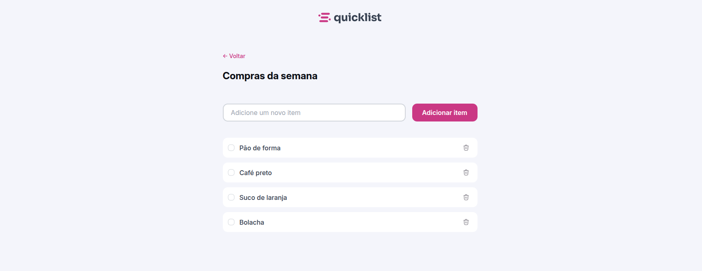
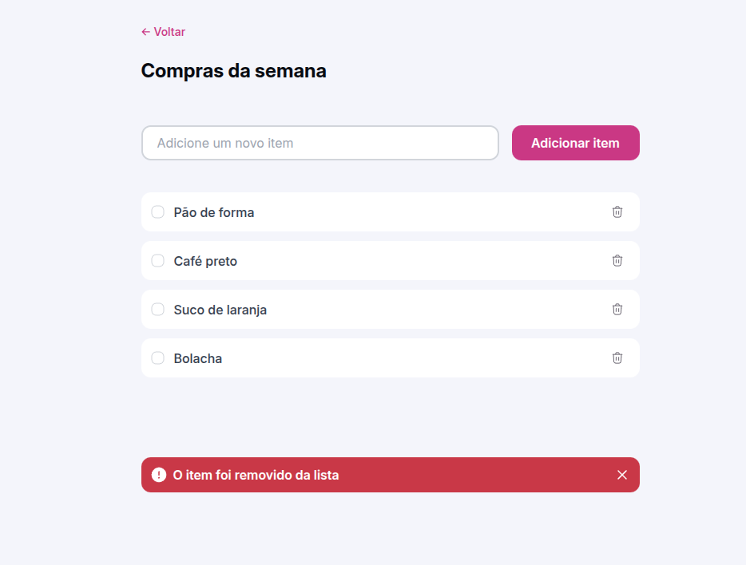

# 📝 Quicklist

Aplicação de lista de tarefas simples, desenvolvida para praticar manipulação do DOM e eventos em JavaScript.

---

## 🖼️ Preview

   
  

---

## 🚀 Funcionalidades

- Adicionar itens na lista (com botão ou tecla _Enter_).
- Marcar itens como concluídos.
- Remover itens da lista.
- Exibir alerta ao excluir.

---

## 🛠️ Tecnologias

- **HTML**
- **CSS**
- **JavaScript**

---

## ▶️ Como Executar

1. Clone este repositório.
2. Abra o arquivo `index.html` no navegador.

---
