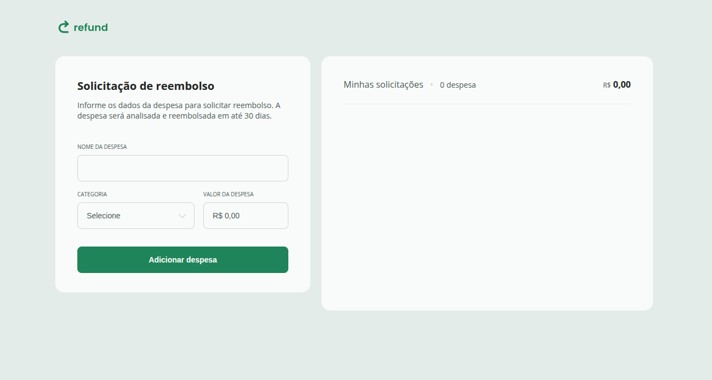
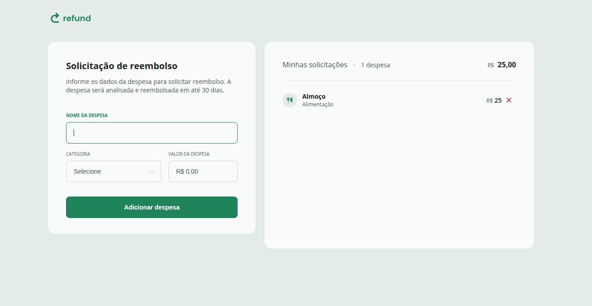

# 💸 Refund

Projeto de controle de despesas 
O objetivo é praticar manipulação de **listas dinâmicas com JavaScript**, além de eventos, cálculos e atualização do DOM em tempo real.

---

## 🖼️ Preview

<p align="center">
  <br>
  
</p>

---

## 🚀 Funcionalidades
- Adicionar despesas com **nome, categoria e valor**.  
- Exibir lista dinâmica de despesas cadastradas.  
- Atualizar automaticamente:
  - **Quantidade de despesas**.
  - **Total gasto** formatado em BRL.  
- Remover despesas individualmente.  
- Validação de valores e tratamento de erros.

---

## 🛠️ Tecnologias
- **HTML5**
- **CSS3**
- **JavaScript (DOM, Eventos, Manipulação de Listas)**

---

## ▶️ Como Executar
1. Clone este repositório.
2. Acesse a pasta do projeto:
   ```bash
   cd refund
3.Abra o arquivo index.html no navegador.

Cadastre suas despesas e veja os cálculos automáticos em tempo real.